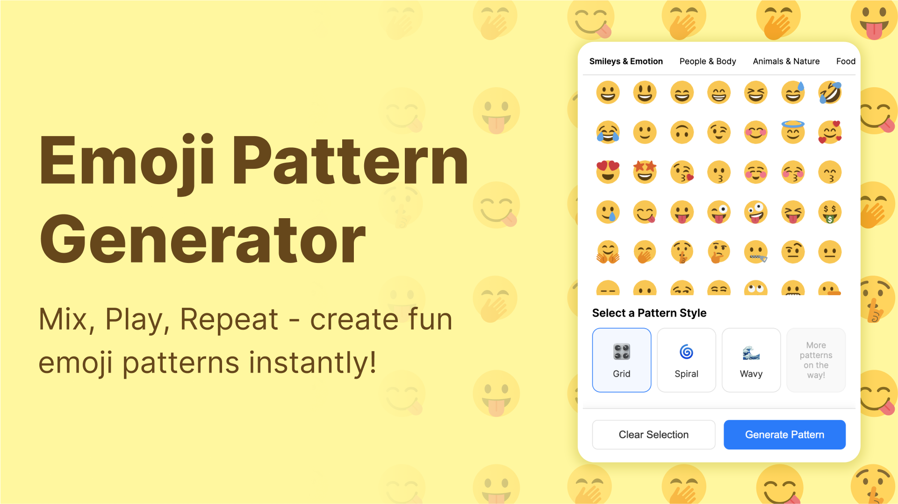

# Emoji Pattern Generator Plugin for Figma  

A Figma plugin that generates beautiful patterns using emojis. Create unique designs with different pattern styles and emoji combinations.  

  

## Development  

Install the packages:  
```sh
npm i
```  

Run the plugin in dev mode:  
```sh
npx webpack --mode=development --watch
```  

Build for production:  
```sh
npx webpack --mode=production
```  

## Thanks  
This project was inspired by and built upon the work from [Figmoji](https://github.com/yenargy/figmoji). Big thanks to the original creator for the foundation!  

## License  
MIT License  
